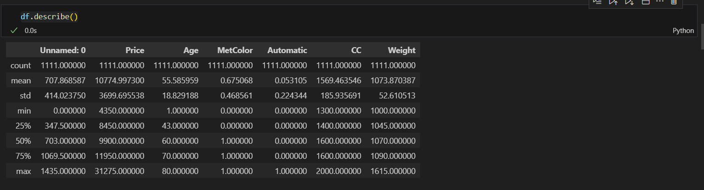
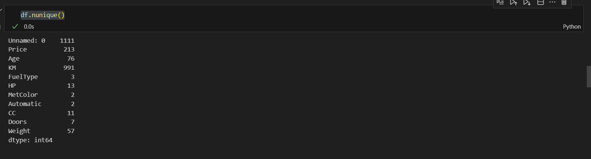
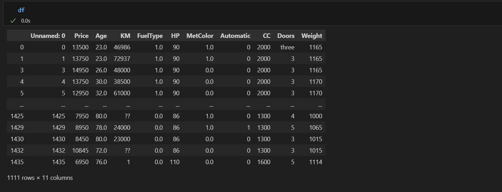
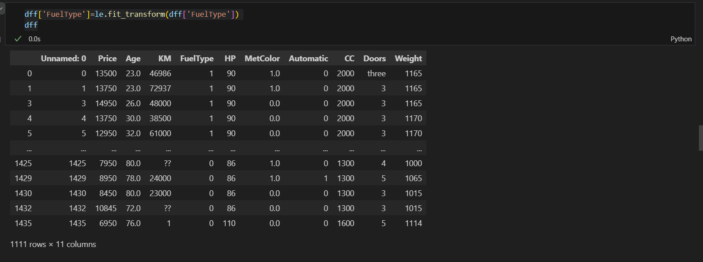
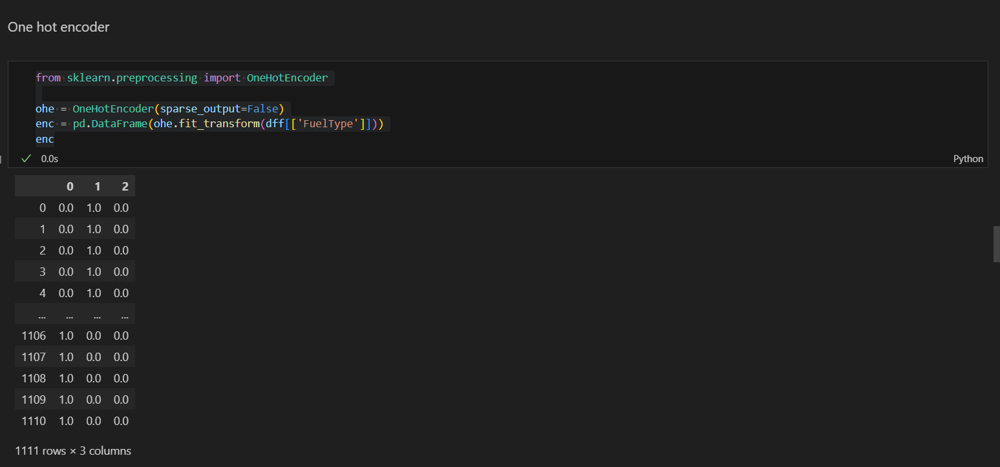
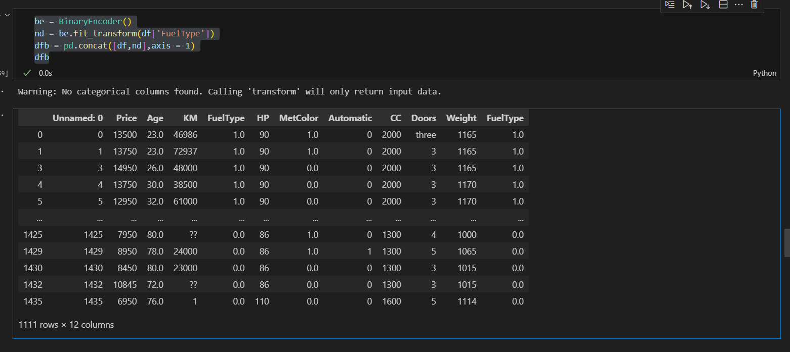
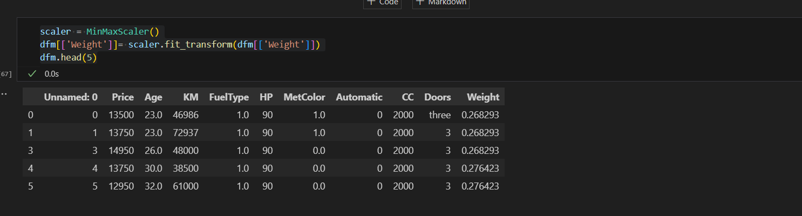
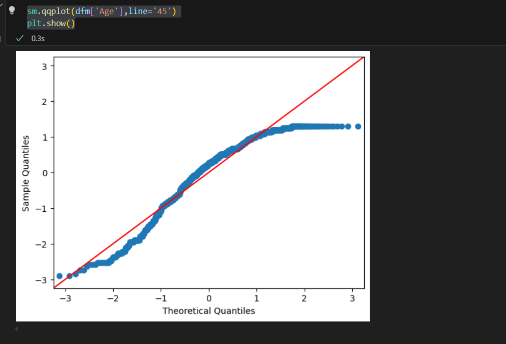
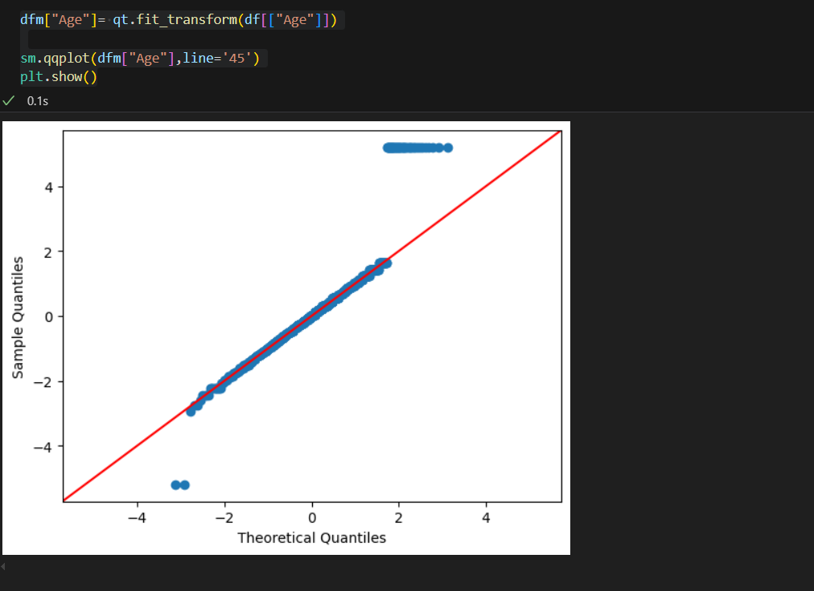

# APPDSEX1
Implementing Data Preprocessing and Data Analysis

```
Name : Nemaleshwar H
Reg.No: 212223230142
```

## AIM:
To implement Data analysis and data preprocessing using a data set

# ALGORITHM:
## Step 1:
 Import the data set necessary

## Step 2:
 Perform Data Cleaning process by analyzing sum of Null values in each column a dataset.

## Step 3:
 Perform Categorical data analysis.

## Step 4: 
Use Sklearn tool from python to perform data preprocessing such as encoding and scaling.

## Step 5: 
Implement Quantile transfomer to make the column value more normalized.

## Step 6:
 Analyzing the dataset using visualizing tools form matplot library or seaborn.

## CODING AND OUTPUT:
# import liberaries 
```py
import pandas as pd
import scipy as sc
import numpy as np
from sklearn.preprocessing import MinMaxScaler
import seaborn as sns
import matplotlib.pyplot as plt
```

# data cleaning
```py
df.shape
df.info()
df.isna().sum()
df.dropna(axis=0 ,how = "any",inplace= True)
df.describe()

```


# Removing outliers
```py
q1,q3 = np.percentile(df['Age'],[25,75])
iqr = q3-q1
lower = q1 -(1.5*iqr)
upper = q3 +(1.5*iqr)

cleaned = df[(df['Age']>=lower) & (df['Age']<=upper)]
df.nunique()

```


# data preprocessing

# ordinal encoder
```py
from sklearn.preprocessing import LabelEncoder , OrdinalEncoder
pm = ["Petrol","Diesel","CNG"]
e1 = OrdinalEncoder(categories = [pm])
df["FuelType"] = e1.fit_transform(df[["FuelType"]])
df

```


# label encoder

```py
le = LabelEncoder()
dff = df.copy()
dff
dff['FuelType']=le.fit_transform(dff['FuelType'])
dff

```


# one hot encoder

```py
from sklearn.preprocessing import OneHotEncoder

ohe = OneHotEncoder(sparse_output=False)
enc = pd.DataFrame(ohe.fit_transform(dff[['FuelType']]))
enc
```


# binary encoder

```py
from category_encoders import BinaryEncoder
dfb = df.copy()
dfb
be = BinaryEncoder()
nd = be.fit_transform(df['FuelType'])
dfb = pd.concat([df,nd],axis = 1)
dfb

```


# scaler 
```py
from sklearn.preprocessing import MinMaxScaler
dfm = df.copy()
dfm
scaler = MinMaxScaler()
dfm[['Weight']]= scaler.fit_transform(dfm[['Weight']])
dfm.head(5)
```


# Normalizer
 ```py
 from sklearn.preprocessing import Normalizer
scaler = Normalizer()
df[['Weight']]= scaler.fit_transform(df[["Weight"]])
df[['Weight']]

 ```
 # standard scaler
 ```py
from sklearn.preprocessing import StandardScaler
sc= StandardScaler()
dfm [['Age']]=sc.fit_transform(dfm[['Age']])
dfm.head(5)
import statsmodels.api as sm
sm.qqplot(dfm['Age'],line='45')
plt.show()
from sklearn.preprocessing import QuantileTransformer
qt = QuantileTransformer(output_distribution="normal")
dfm["Age"]= qt.fit_transform(df[["Age"]])

sm.qqplot(dfm["Age"],line='45')
plt.show()
 ```



## RESULT:
Thus Data analysis and Data preprocessing implemeted using a dataset.
